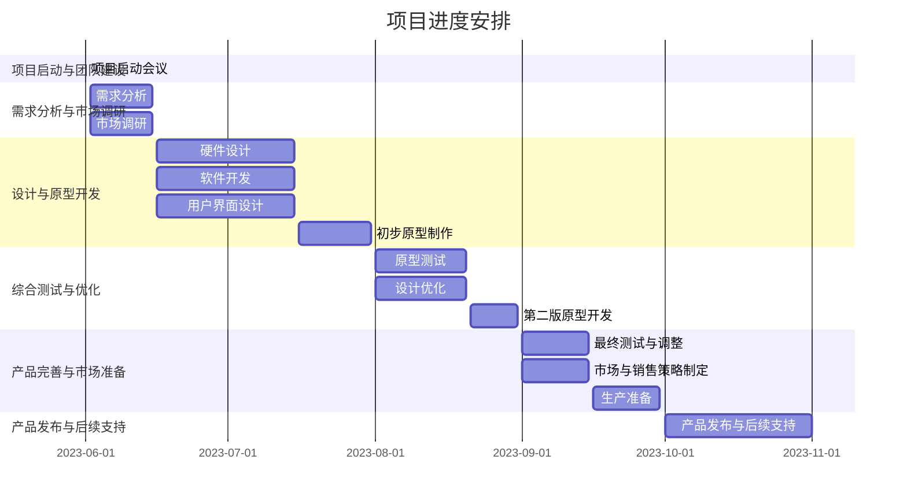

| 任务             | 开始日期    | 结束日期    |
| -------------- | ---------- | ---------- |
| 项目启动会议   | 2023-06-01 | 2023-06-01 |
| 需求分析       | 2023-06-02 | 2023-06-15 |
| 市场调研       | 2023-06-02 | 2023-06-15 |
| 硬件设计       | 2023-06-16 | 2023-07-15 |
| 软件开发       | 2023-06-16 | 2023-07-15 |
| 用户界面设计   | 2023-06-16 | 2023-07-15 |
| 初步原型制作   | 2023-07-16 | 2023-07-31 |
| 原型测试       | 2023-08-01 | 2023-08-20 |
| 设计优化       | 2023-08-01 | 2023-08-20 |
| 第二版原型开发 | 2023-08-21 | 2023-08-31 |
| 最终测试与调整 | 2023-09-01 | 2023-09-15 |
| 市场与销售策略制定 | 2023-09-01 | 2023-09-15 |
| 生产准备       | 2023-09-16 | 2023-09-30 |
| 产品发布与后续支持 | 2023-10-01 | 2023-11-01 |