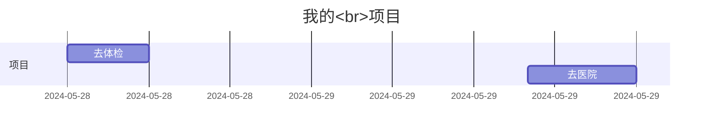

```mermaid
gantt
    title 我的<br>项目
    dateFormat  YYYY-MM-DD HH:mm
    section 项目
    去体检 :des1, 2024-05-28 15:00, 2024-05-28 18:00
    去医院 :des2, 2024-05-29 08:00, 2024-05-29 12:00
```
| 任务   | 开始时间              | 结束时间              |
| ------ | ------------------- | ------------------- |
| 去体检 | 2024-05-28 15:00 | 2024-05-28 18:00 |
| 去医院 | 2024-05-29 08:00 | 2024-05-29 12:00 |